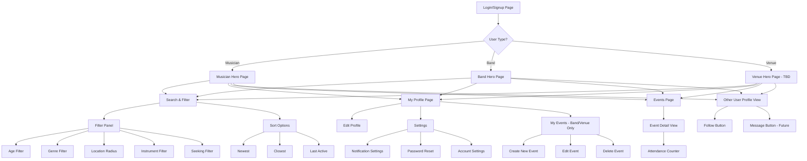
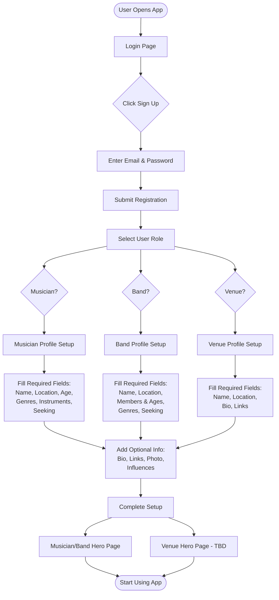
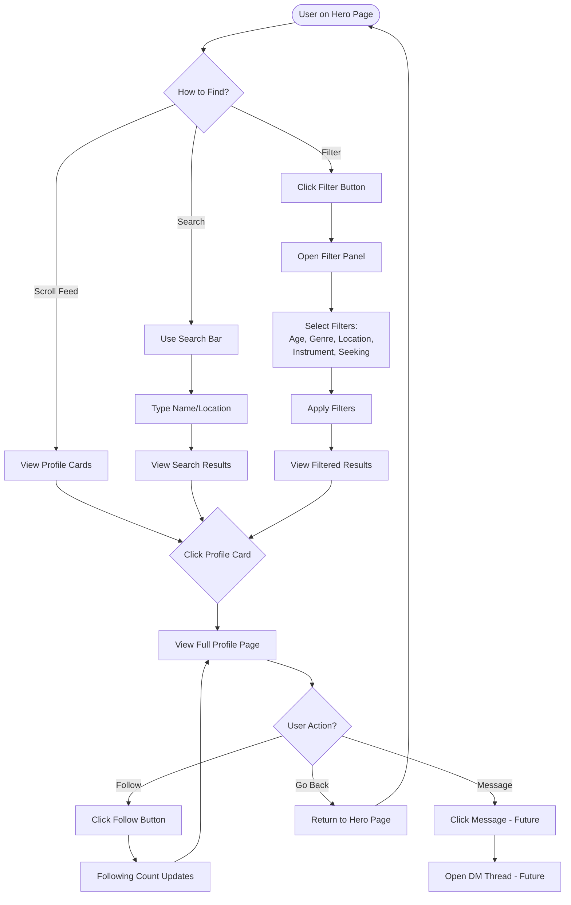
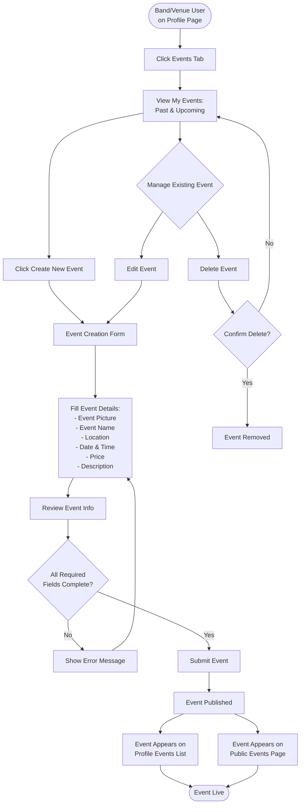
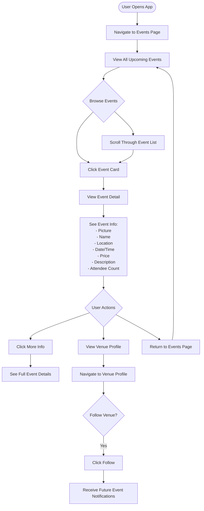
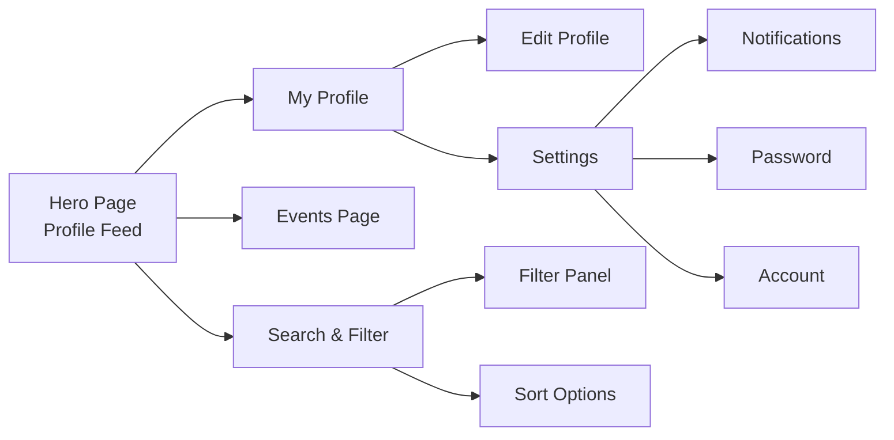
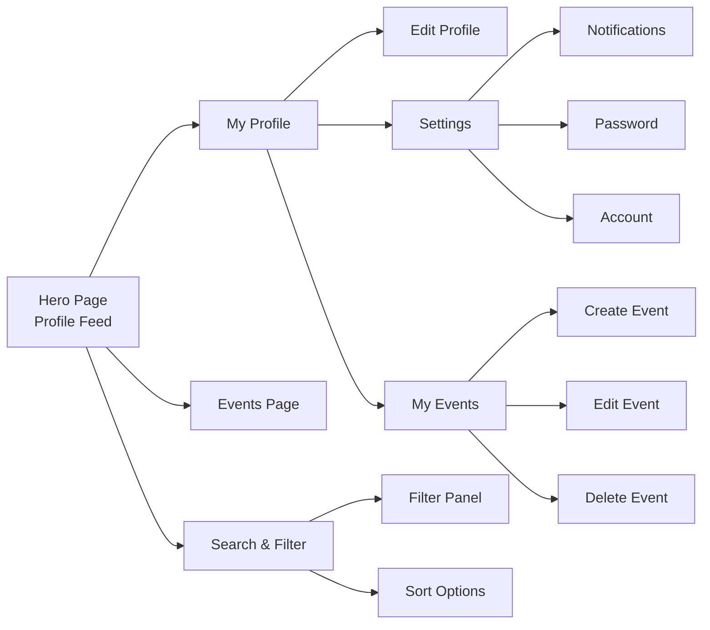
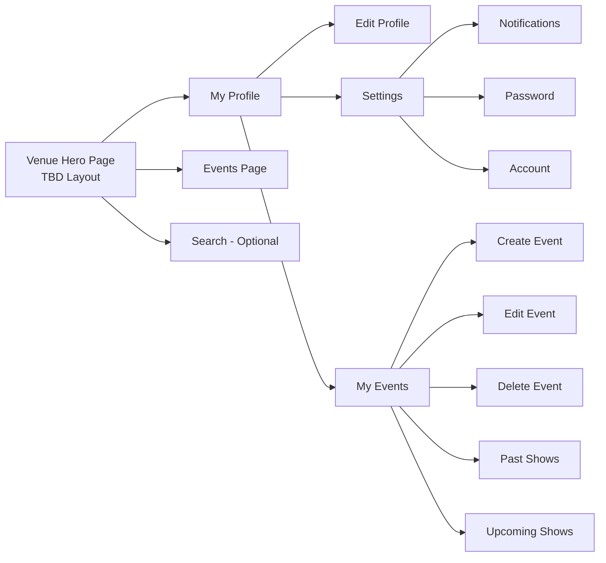
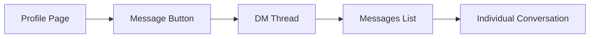
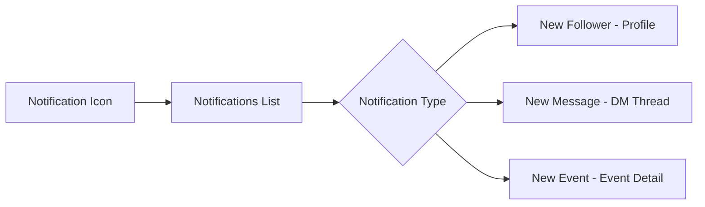

# BandScope - Navigation Flow & Sitemap

## Table of Contents
1. [Complete Sitemap](#complete-sitemap)
2. [User Flow: New User Signup](#user-flow-new-user-signup)
3. [User Flow: Musician/Band Finding & Following](#user-flow-musicianband-finding--following)
4. [User Flow: Event Creation (Band/Venue)](#user-flow-event-creation-bandvenue)
5. [User Flow: Event Discovery](#user-flow-event-discovery)
6. [Navigation Structure by User Type](#navigation-structure-by-user-type)

---

## Complete Sitemap



---

## User Flow: New User Signup



---

## User Flow: Musician/Band Finding & Following



---

## User Flow: Event Creation (Band/Venue)



---

## User Flow: Event Discovery



---

## Navigation Structure by User Type

### Musician Navigation



### Band Navigation



### Venue Navigation



---

## Page Transition Matrix

| From Page | To Page | Trigger |
|-----------|---------|---------|
| Login | Hero Page | Successful login |
| Signup | Profile Setup | Account creation |
| Profile Setup | Hero Page | Setup completion |
| Hero Page | Profile View | Click profile card |
| Hero Page | My Profile | Nav button |
| Hero Page | Events Page | Nav button |
| Hero Page | Filter Panel | Filter button |
| Profile View | Hero Page | Back button |
| My Profile | Edit Profile | Edit button |
| My Profile | Settings | Settings button |
| My Profile | My Events | Events tab (Band/Venue only) |
| My Events | Create Event | Create button |
| Events Page | Event Detail | Click event card |
| Event Detail | Venue Profile | Click venue name |

---

## Bottom Navigation Bar (Mobile)

```
┌─────────────────────────────────────┐
│  [Home]  [Events]  [Profile]  [•••] │
└─────────────────────────────────────┘

Home: Hero Page (feed of profiles)
Events: Events Page (all upcoming events)
Profile: My Profile Page
•••: More options (Settings, Logout, etc.)
```

---

## Key Navigation Principles

### 1. **Consistent Navigation**
- Bottom nav bar always visible on mobile
- Top nav/header on desktop
- Maximum 3 taps to reach any page

### 2. **Clear Back Navigation**
- Back buttons on all sub-pages
- Breadcrumb trail on desktop
- Swipe gestures for mobile

### 3. **Contextual Actions**
- Actions appear where relevant
- Follow button on profiles
- Create event from profile events tab
- Edit from within profile view

### 4. **Role-Based Access**
- Musicians: Cannot create events
- Bands: Can create events
- Venues: Can create events + different hero page

### 5. **Search & Discovery**
- Always accessible from hero page
- Persistent search bar
- Quick filters vs. advanced filters

---

## Screen State Management

### Hero Page States
- **Loading**: Skeleton cards while fetching profiles
- **Empty**: No profiles found message
- **Populated**: Grid/list of profile cards
- **Filtered**: Showing filtered results with clear filters button

### Profile Page States
- **Own Profile**: Edit and Settings buttons visible
- **Other's Profile**: Follow and Message buttons visible
- **Loading**: Skeleton layout
- **Not Found**: Profile doesn't exist message

### Events Page States
- **Loading**: Skeleton event cards
- **No Events**: "No upcoming events" message
- **Populated**: List of event cards
- **Past Events**: Separate view/toggle for past events

---

## Future Navigation Additions (Post-MVP)

### Direct Messaging Flow


### Notifications Flow


---

**Document Version**: 1.0  
**Last Updated**: January 2026  
**Status**: Ready for Development